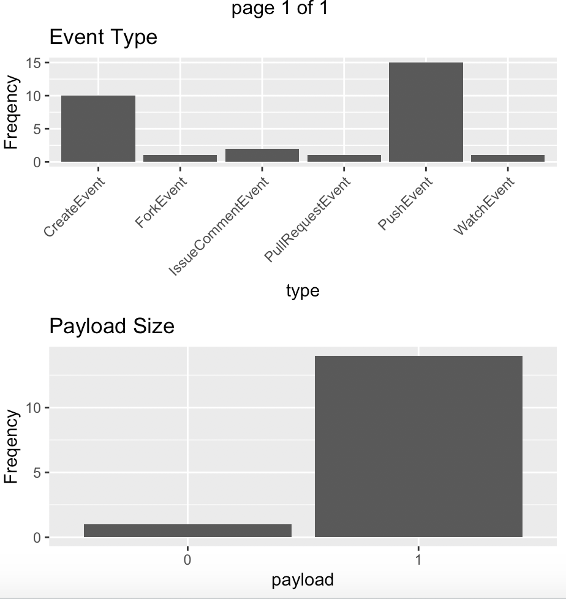
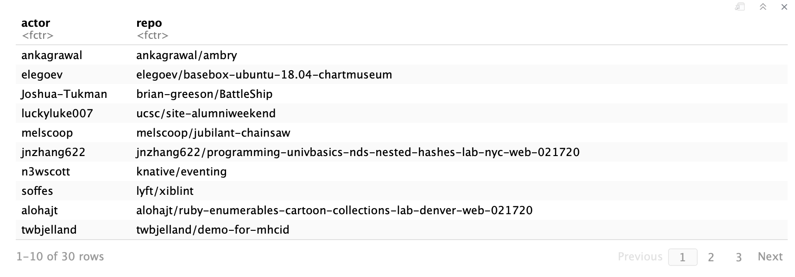
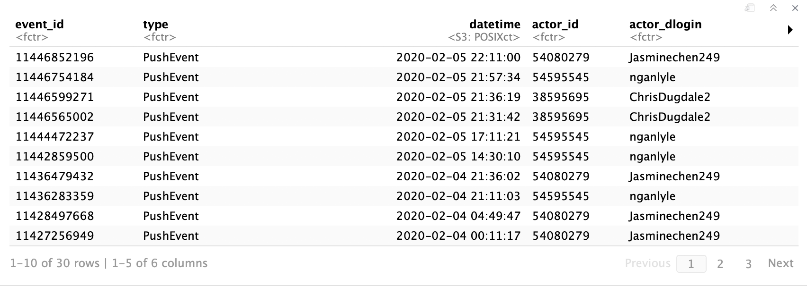
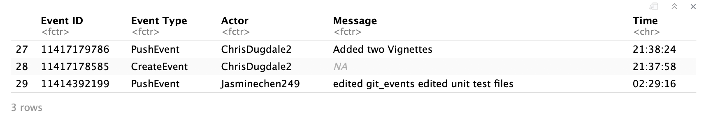

<!-- README.md is generated from README.Rmd. Please edit that file -->

# gitevents [](https://travis-ci.org/nganlyle/534_project)


<!-- badges: start -->
<!-- badges: end -->

The package of gitevents provides functions for read-only access to GitHub public events and repository events API. Information on the most recent 30 events are available. Functionality includes a function returning plots and lists providing basic information about public events and a function to create a "labbook stamp" showing events for a given repository and date.

## Data Sources
This set of functions/package accesses data from:

+ api.github.com
	+ <https://api.github.com>
	+ See documentation on the Github API <https://developer.github.com/v3/>
  
## Installation
```{r}
library(devtools)
```

```{r}
install_github("nganlyle/534_project")
library(gitevents)
```

## Examples 
The get_events_plots function creates two bar plots for event type and payload size.
```{r}
get_events_plots()
```


The get_events_lists function creates two lists of actors and repos.
```{r}
get_events_lists()
```


The function create_repo_df assembles the list of lists of git hub events into a data frame for further processing.
```{r}
create_repo_df('nganlyle', '534_project')
```


The get_repo_log function selects the event ID, event type, actor, message, and time of git events from the data frame created by the create_repo_df function. It is limited to thirty previous events from the past nintey days.
```{r}
get_repo_log('nganlyle', '534_project', '2020-02-02')
```


## Meta

* Please [report any issues or bugs](https://github.com/nganlyle/534_project/issues).
* License: MIT
* Get citation information for `gitevents` in R doing `citation(package = 'gitevents')`
